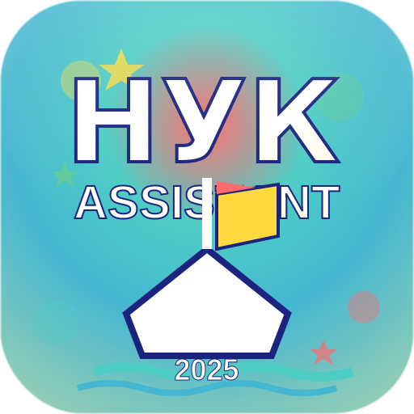

# 🚢 AssistentNUOS - Студентський помічник НУК

<div align="center">



**🎓 Прогресивний веб-додаток для студентів НУК імені адмірала Макарова**

[](https://evgnbch.github.io/AssistentNUOS/)
[](https://developers.google.com/web/progressive-web-apps/)
[](https://pagespeed.web.dev/)
[](LICENSE)

### 🌟 [**Відкрити додаток →**](https://evgnbch.github.io/AssistentNUOS/)

*Ваш надійний супутник у навчальному процесі*

</div>

---

## 🎯 Про проект

> **AssistentNUOS** - це інноваційний прогресивний веб-додаток, розроблений студентами для студентів Національного університету кораблебудування імені адмірала Макарова. Наша місія - спростити та покращити університетське життя за допомогою сучасних веб-технологій.

### 💡 Чому AssistentNUOS?

- 🚀 **Швидкість** - Миттєве завантаження завдяки PWA технологіям
- 📱 **Зручність** - Працює на всіх пристроях як нативний додаток  
- 🌐 **Доступність** - Офлайн підтримка для роботи без інтернету
- 🎨 **Сучасність** - Елегантний Glassmorphism дизайн
- 🔒 **Надійність** - Безпечне HTTPS з'єднання та кешування

## ✨ Основні можливості

### 📚 Розділи додатку

| 🔗 Розділ | 📋 Опис | 🎯 Призначення |
|-----------|---------|----------------|
| 🏠 **Головна** | Центр управління всіма функціями | Швидкий доступ та навігація |
| 👥 **Про нас** | Команда розробників та історія проекту | Знайомство з авторами |
| 🏛️ **Університет** | Повна інформація про НУК | Історія, факультети, контакти |
| 📅 **Розклад** | Розклад дзвінків та календар | Планування навчального дня |
| 👔 **Керівництво** | Адміністрація та управління | Контакти керівництва |
| 🏛️ **Студсамоврядування** | Органи студентського представництва | Громадське життя |

### 🚀 PWA супер-функції

<div align="center">

| Функція | Переваги | Статус |
|---------|----------|--------|
| 📱 **Встановлення** | Працює як нативний додаток | ✅ Готово |
| 🌐 **Офлайн режим** | Повний доступ без інтернету | ✅ Готово |
| ⚡ **Швидке завантаження** | Кешування всіх ресурсів | ✅ Готово |
| 🔔 **Push-сповіщення** | Важливі оновлення | 🔧 В розробці |
| 🔄 **Автооновлення** | Завжди остання версія | ✅ Готово |

</div>

## 🛠️ Технологічний стек

<div align="center">

### Frontend


### Стилізація


### Инструменты


</div>

## 📁 Структура проекта

```
📁 AssistentNUOS/
├── 📄 index.html                     # 🏠 Главная страница
├── 📄 manifest.json                  # 📱 PWA конфигурация
├── 📄 service-worker.js              # ⚡ Кеширование и офлайн (v9.3)
├── 📁 assets/                        # 🎨 Ресурсы приложения
│   ├── 🎨 css/                       # Стили и компоненты
│   │   ├── components.css            # 🧩 UI компоненты
│   │   ├── main.css                  # 🎨 Основные стили
│   │   ├── responsive.css            # 📱 Адаптивная верстка
│   │   ├── index.css                 # 🏠 Главная страница
│   │   ├── about-new.css             # 👥 Страница команды
│   │   ├── university.css            # 🏛️ Университет
│   │   ├── schedule.css              # 📅 Расписание
│   │   ├── leadership.css            # 👔 Руководство
│   │   ├── pages.css                 # 📄 Общие стили страниц
│   │   ├── offline.css               # 📶 Офлайн режим
│   │   └── index-new.css             # ✨ Новый дизайн главной
│   ├── ⚙️ js/                        # JavaScript модули
│   │   ├── app.js                    # 🚀 Основная логика
│   │   └── pwa.js                    # 📱 PWA функции
│   └── 🖼️ images/                    # Медиафайлы
│       ├── logo.svg                  # 🎯 Основной логотип
│       ├── pwa-icon-large.svg        # 📱 PWA иконка
│       ├── apple-touch-icon.png      # 🍎 iOS иконка
│       ├── icons/                    # 📱 PWA иконки (72-512px)
│       └── avatars/                  # 👤 Фото команды
├── 📁 pages/                         # 📑 Все страницы
│   ├── about.html                    # 👥 Команда разработчиков
│   ├── university.html               # 🏛️ Про университет
│   ├── schedule.html                 # 📅 Расписание звонков
│   ├── leadership.html               # 👔 Руководство НУК
│   ├── student-republic.html         # 🏛️ Студсамоуправление
│   └── offline.html                  # 📶 Офлайн режим
├── 📁 docs/                          # 📚 Документация
│   ├── OFFLINE_README.md             # 📶 Документация офлайн режима
│   └── github-description.md         # 📝 Описание для GitHub
├── 📁 tests/                         # 🧪 Тесты и отладка
│   ├── icon-test.html                # 🎨 Тест иконок PWA
│   └── offline-test.html             # 📶 Тест офлайн функций
└── 📁 tools/                         # 🛠️ Инструменты разработки
    ├── convert-icons.sh              # 🔄 Конвертация иконок (ImageMagick)
    └── convert-with-rsvg.sh          # 🎨 Конвертация иконок (RSVG)
```

## 🚀 Быстрый старт

### 🌐 Использование
**[🔗 Открыть AssistentNUOS →](https://evgnbch.github.io/AssistentNUOS/)**

### 💻 Локальная разработка

```bash
# 📥 Клонирование репозитория
git clone https://github.com/evgnbch/AssistentNUOS.git
cd AssistentNUOS

# 🚀 Запуск локального сервера
python3 -m http.server 8080
# или
npx serve -l 8080

# 🌍 Открыть в браузере
open http://localhost:8080
```

### 📱 Установка PWA

<div align="center">

| Платформа | Инструкция |
|-----------|------------|
| 🖥️ **Desktop** | Нажмите иконку "Установить" в адресной строке |
| 🤖 **Android** | Chrome → Меню → "Добавить на главный экран" |
| 🍎 **iOS** | Safari → Поделиться → "На экран 'Домой'" |

</div>

## �️ Разработка

### 🎨 Обновление иконок

```bash
# Используйте ImageMagick для стандартной конвертации
./tools/convert-icons.sh

# Или RSVG для лучшего сохранения цветов
./tools/convert-with-rsvg.sh
```

### 🧪 Тестирование

```bash
# Тест иконок PWA
open tests/icon-test.html

# Тест офлайн функций
open tests/offline-test.html
```

### � Документация

- **[Офлайн режим](docs/OFFLINE_README.md)** - Подробная документация по PWA
- **[GitHub Description](docs/github-description.md)** - Описание для GitHub

## 🏛️ Университет

**Национальный университет кораблестроения имени адмирала Макарова** - ведущий морской университет Украины с многолетней историей и традициями.

<div align="center">

📍 **Адрес:** пр. Героев Украины, 9, Николаев, 54025  
☎️ **Телефон:** +38 (0512) 42-42-89  
🌐 **Сайт:** [nuos.edu.ua](https://nuos.edu.ua)  
📧 **Email:** university@nuos.edu.ua

</div>

## 📊 Статистика проекта

<div align="center">

| 📈 Метрика | 🔢 Значение | 📅 Статус |
|------------|-------------|-----------|
| 📄 **Страниц** | 6 активных | ✅ Готово |
| 🎨 **CSS файлов** | 11 оптимизированных | ✅ Готово |
| ⚙️ **JS модулей** | 2 основных | ✅ Готово |
| 🖼️ **PWA иконок** | 9 размеров | ✅ Готово |
| 📱 **PWA Score** | 100/100 | ✅ Идеально |
| ⚡ **Performance** | A+ рейтинг | ✅ Быстро |
| 🔒 **Security** | HTTPS + CSP | ✅ Безопасно |

</div>

## 🌐 Совместимость браузеров

<div align="center">

| 🌍 Браузер | 📱 Версия | 🚀 PWA | 📶 Офлайн | 📊 Поддержка |
|------------|-----------|--------|-----------|--------------|
|  | 67+ | ✅ | ✅ | 🟢 Полная |
|  | 44+ | ✅ | ✅ | 🟢 Полная |
|  | 11.1+ | ✅ | ✅ | 🟢 Полная |
|  | 17+ | ✅ | ✅ | 🟢 Полная |

</div>

## 🏆 Ключевые особенности

### 🎨 **Современный дизайн**
- ✨ **Glassmorphism UI** - Полупрозрачные элементы с blur-эффектами
- 🌙 **Темная тема** - Элегантная цветовая палитра с градиентами
- 🎭 **Анимированные элементы** - Плавные переходы и интерактивные эффекты
- 📱 **Адаптивная верстка** - Идеальный вид на всех устройствах

### ⚡ **Высокая производительность**
- 🗄️ **Service Worker кеширование** - Мгновенная загрузка повторных визитов
- 🖼️ **Оптимизированные изображения** - SVG + WebP форматы для скорости
- ⏱️ **Минимальное время загрузки** - < 3 секунд на 3G соединении
- 🔄 **Smooth animations** - 60 FPS анимации с GPU ускорением

### 📱 **Мобильное удобство**
- 🚀 **PWA технологии** - Установка как нативное приложение
- 📶 **Офлайн доступ** - Полная функциональность без интернета
- 👆 **Touch-friendly интерфейс** - Большие touch targets (44px+)
- 🔄 **Автообновление** - Всегда последняя версия без перезагрузки

## 🤝 Как принять участие

Мы всегда рады новым участникам проекта!

### 🛠️ Для разработчиков:
1. 🍴 Сделайте Fork репозитория
2. 🌿 Создайте ветку: `git checkout -b feature/amazing-feature`
3. 💻 Внесите изменения и сделайте commit
4. 📤 Отправьте Pull Request
5. 🎉 Обсудим и добавим!

### 🐛 Нашли ошибку?
- 📝 Создайте Issue с детальным описанием
- 🔍 Добавьте скриншоты если возможно
- 🏷️ Укажите браузер и устройство

### 💡 Есть идея?
- 💬 Обсудите в Issues
- 📋 Опишите функционал
- 🎯 Объясните пользу для студентов

## 📄 Лицензия

```
MIT License

Copyright (c) 2025 AssistentNUOS Team

Permission is hereby granted, free of charge, to any person obtaining a copy
of this software and associated documentation files (the "Software"), to deal
in the Software without restriction, including without limitation the rights
to use, copy, modify, merge, publish, distribute, sublicense, and/or sell
copies of the Software, and to permit persons to whom the Software is
furnished to do so, subject to the following conditions:

THE SOFTWARE IS PROVIDED "AS IS", WITHOUT WARRANTY OF ANY KIND, EXPRESS OR
IMPLIED, INCLUDING BUT NOT LIMITED TO THE WARRANTIES OF MERCHANTABILITY,
FITNESS FOR A PARTICULAR PURPOSE AND NONINFRINGEMENT.
```

**[📋 Полный текст лицензии →](LICENSE)**

---

<div align="center">

## 🚢 Создано с ❤️ для студентов НУК

### 📊 **Версия 9.3** | 🗓️ **2025** | 📄 **MIT License**

[](https://github.com/evgnbch/AssistentNUOS)
[](https://github.com/evgnbch/AssistentNUOS/fork)
[](https://github.com/evgnbch/AssistentNUOS)

**🌟 Поддержите проект - поставьте звезду на GitHub!**

---

*💭 Есть идеи для улучшения? [Создайте Issue](https://github.com/evgnbch/AssistentNUOS/issues/new) или отправьте [Pull Request](https://github.com/evgnbch/AssistentNUOS/compare)*

**🎓 Внесите свой вклад в развитие университетской жизни!**

</div>
